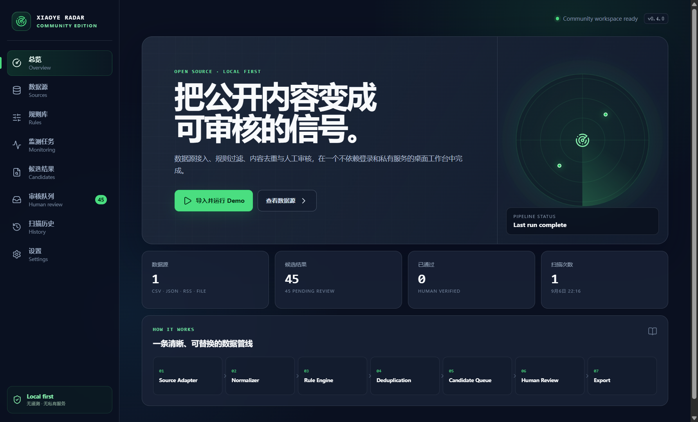
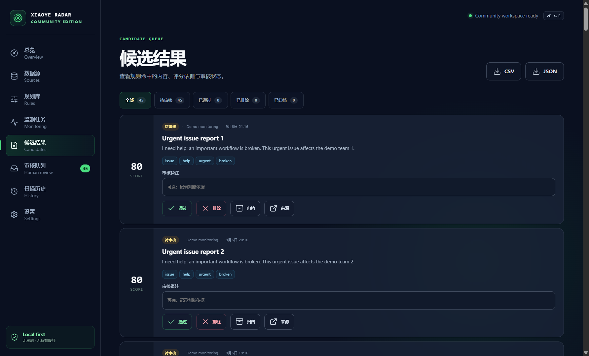
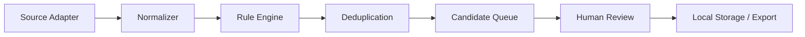

# Xiaoye Radar

**Open-source public content monitoring, filtering and human-review toolkit.**

[中文说明](README.zh-CN.md) · [Architecture](docs/architecture.md) · [Adapter SDK](docs/source-adapter.md) · [Rules](docs/rules.md) · [Community](docs/community.md) · [Compliance](docs/compliance.md)

Xiaoye Radar Community turns authorized, public-content exports into a local review workflow. Import CSV, JSON, RSS/Atom, Markdown, or text files; apply source-neutral rules; remove duplicates; review candidates; and export the result without signing in to a platform or calling a private service.

> Status: `v0.4.0` Community Edition. Windows portable builds are currently unsigned. Security reports use GitHub Private Vulnerability Reporting rather than public issues.



## Why Xiaoye Radar

Monitoring projects repeatedly need the same middle layer: normalize several input formats, filter a time window, apply include and exclusion rules, rank matches, suppress repeats, keep an audit trail, and leave the final decision to a person. Xiaoye Radar packages that workflow as a usable desktop application and small TypeScript workspaces.

The Community Edition is useful on its own. It has no Pro license check, private API, account login, telemetry, or automatic updater.

## Features

- Configurable include, exclude, text-contains, source, time-window, score, priority, and enabled-state rules
- SHA-256 deduplication by content, source ID, or URL, scoped to a semantic rule revision
- CSV, JSON, local RSS/Atom file, Markdown, and text adapters
- Strict normalization with nested sensitive-metadata removal and a 10 MiB source-file limit
- Local JSON workspace with serialized atomic writes
- Pending, approved, rejected, and archived review states
- CSV and JSON export with spreadsheet-formula injection protection
- Synthetic 80-record Demo plus legal, customer-feedback, brand, and recruitment examples
- Hardened Electron bridge with context isolation, sandboxing, sender validation, and a restrictive CSP
- English developer documentation and a bilingual desktop interface



## Architecture



The public repository is a small npm-workspaces monorepo:

```text
apps/community-desktop   Electron main, preload, renderer and IPC contracts
packages/core            Rules, scoring and deduplication
packages/source-sdk      Adapter lifecycle and built-in file adapters
packages/storage         Independent local JSON workspace
packages/review-engine   Review-state transitions
packages/export          Safe CSV and JSON output
examples                 Synthetic data and rule packs
tests                    Unit and end-to-end service integration tests
```

See [docs/architecture.md](docs/architecture.md) for trust boundaries and the Community/Pro relationship.

## Quick start

### Requirements

- Windows 10 or 11 for the desktop release
- Node.js `22.12` or newer for source development
- npm, included with Node.js

### Run from source

```bash
git clone https://github.com/yel66026-stack/xiaoye-radar.git
cd xiaoye-radar
npm ci
npm run dev
```

The install and development commands do not need a private registry or secret.

### Verify and package

```bash
npm run verify
npm run dist:win
npm run smoke:portable
```

`npm run verify` runs formatting checks, ESLint, TypeScript, Vitest, current-tree and complete-history secret scanning, and a production build. `dist:win` writes the portable executable to `release/community/`, which is intentionally ignored by Git.

## Demo

Open the app and choose **Import and run Demo**. One click performs the full workflow using synthetic content:

| Result               | Count |
| -------------------- | ----: |
| Input records        |    80 |
| Candidates           |    45 |
| Duplicate records    |     5 |
| Excluded records     |    10 |
| Outside time window  |    10 |
| Below rule threshold |    10 |

The integration test fixes these counts so a change to parsing, ordering, filtering, or persistence cannot silently alter the demonstration.

## Rule engine

Rules are JSON or YAML. This minimal example accepts recent requests for help, removes advertising, scores useful phrases, and deduplicates normalized content:

```yaml
id: starter-feedback-rule
name: Starter feedback triage
enabled: true
priority: normal

time_window:
  days: 30

include: [help, feedback, issue]
exclude: [advertisement, sponsored]

score:
  urgent: 25
  broken: 18

basic_score: 5
minimum_score: 10
deduplication: content
```

Read [docs/rules.md](docs/rules.md) for evaluation order and field semantics.

For the first public release, a non-empty `regex` field is rejected. User-supplied regular expressions will remain disabled until evaluation is isolated from the Electron main process with a hard timeout.

## Source Adapter SDK

Every source implements a small lifecycle:

```ts
export interface SourceAdapter<TConfig = unknown, TRaw = unknown> {
  readonly kind: string
  initialize(config: TConfig): Promise<void>
  validateConfig(config: unknown): AdapterValidation
  fetch(): Promise<NormalizedContent[]>
  normalize(raw: TRaw, index: number): NormalizedContent
  healthCheck(): Promise<AdapterHealth>
  dispose(): Promise<void>
}
```

The first release ships file-based adapters. It deliberately does not ship a crawler, CAPTCHA workaround, credential collector, or authentication bypass. The workspace packages are source workspaces in `v0.4.0`; they are not claimed as published npm packages. See [docs/source-adapter.md](docs/source-adapter.md).

## Examples

- [Demo monitoring](examples/demo-monitoring/README.md), an exact end-to-end fixture
- [Legal help triage](examples/legal-lead-triage/README.md), a synthetic rule-engine example rather than a product definition
- [Customer feedback](examples/customer-feedback/README.md)
- [Brand monitoring](examples/brand-monitoring/README.md), using a fictional brand
- [Recruitment monitoring](examples/recruitment-monitoring/README.md)

All committed example content is synthetic. Replace it only with data you are authorized to process.

## Community and Pro

| Capability                          | Community      | Pro                                        |
| ----------------------------------- | -------------- | ------------------------------------------ |
| General rule engine                 | Yes            | Existing commercial equivalent             |
| CSV, JSON, RSS/Atom and local files | Yes            | Product-dependent                          |
| Local storage and human review      | Yes            | Yes                                        |
| Public Adapter SDK contract         | Yes            | Private integration pending owner decision |
| Platform-specific integrations      | No             | Yes                                        |
| Account, login and session handling | No             | Yes                                        |
| Professional rule packs and scoring | Basic examples | Advanced commercial assets                 |
| Commercial automation               | No             | Yes                                        |

No Pro source, platform selector, account state, customer data, or commercial rule pack is included here. The detailed boundary is in [docs/editions.md](docs/editions.md).

## Roadmap

- `v0.4.x`: stabilize Community, imports, accessibility, and documentation
- `v0.5.0`: formalize Source Adapter packaging and compatibility policy
- `v0.6.0`: explore a consent-based plugin ecosystem
- Future candidates: webhook input, notifications, a plugin registry, and additional rule types

The roadmap is directional and does not promise unapproved commercial features. See [ROADMAP.md](ROADMAP.md).

Release changes and current limitations are recorded in [CHANGELOG.md](CHANGELOG.md) and the [`v0.4.0` release notes](docs/RELEASE_NOTES_v0.4.0.md).

## Contributing

Start with [CONTRIBUTING.md](CONTRIBUTING.md). Proposed adapters must document how they obtain data and must not bypass authentication, access controls, rate limits, or platform safeguards.

## Security and privacy

Security reports involving credentials or personal data should not be filed as public issues. Use GitHub Private Vulnerability Reporting as described in [SECURITY.md](SECURITY.md).

Community data stays in its own local directory. Telemetry and automatic updates are not implemented. The renderer has no Node.js access, imported files are size-limited and schema-validated, nested credential-like metadata keys are removed, and external navigation is restricted to credential-free HTTP(S) URLs.

## Compliance

Xiaoye Radar is for content you are allowed to access and process. It does not grant permission to collect data. Follow source terms, applicable law, privacy obligations, and `robots.txt` where relevant. Read [docs/compliance.md](docs/compliance.md) before distributing an adapter.

## License

Apache License 2.0. See [LICENSE](LICENSE) and [THIRD_PARTY_NOTICES.md](THIRD_PARTY_NOTICES.md).
