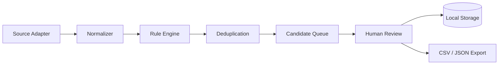
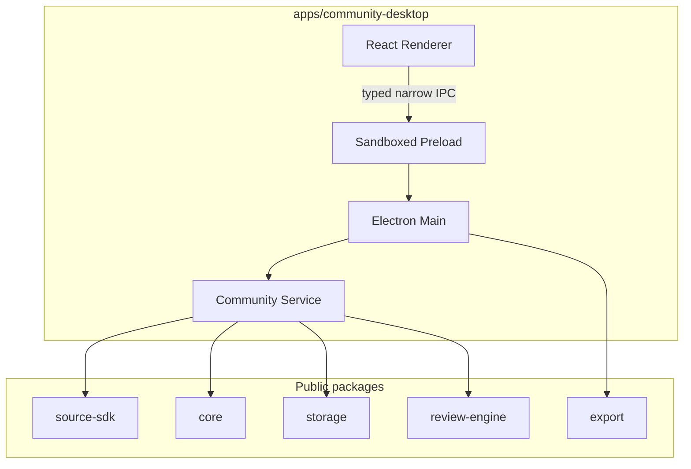
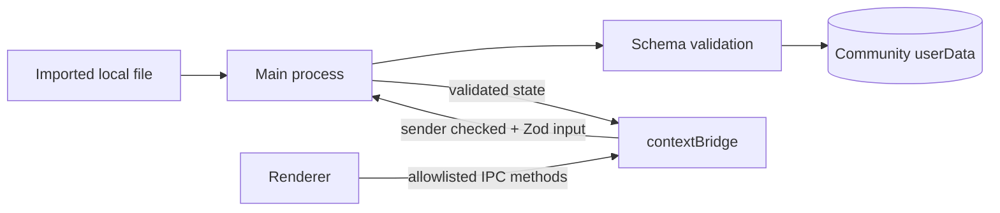
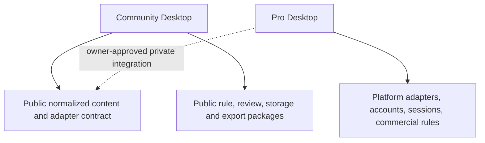

# Architecture

## Goals

Xiaoye Radar Community is an independent, local-first desktop application. Its public core accepts normalized content and does not know whether an item began as CSV, JSON, RSS, or text. It does not need a platform login, Pro module, license server, telemetry endpoint, or update service.

## Data flow



1. A `SourceAdapter` reads an authorized local file.
2. The adapter converts each source record to `NormalizedContent`.
3. The Rule Engine evaluates source, time, include, exclude, text, and score rules.
4. SHA-256 fingerprints suppress repeats within a run and across runs for the same source and rule.
5. Matching items enter the candidate queue.
6. A person approves, rejects, archives, or returns a candidate to pending.
7. Workspace state and source copies are written locally; selected results can be exported.

## Package boundaries



### `packages/core`

Owns schemas for normalized content, rules, decisions, candidates and scan runs. It also owns parsing, evaluation, scoring and fingerprints. It has no Electron or renderer dependency.

### `packages/source-sdk`

Owns the adapter contract, registry, file limits, normalization helpers and built-in CSV, JSON, RSS/Atom, Markdown and text adapters. Source-specific data is reduced to the normalized schema before it crosses the package boundary.

### `packages/storage`

Owns the schema-versioned Community workspace. Writes are serialized and use a temporary file followed by rename. Source IDs are constrained before they can be used as filenames. Community keeps up to 10,000 candidates and 2,000 run records.

### `packages/review-engine`

Owns allowed review transitions and validates notes and timestamps.

### `packages/export`

Owns CSV/JSON serialization. Formula-like CSV values are prefixed so a spreadsheet does not execute them as formulas by default.

## Electron trust boundary



- `contextIsolation: true`
- `nodeIntegration: false`
- `sandbox: true`
- `webSecurity: true`
- no permission request is accepted
- new renderer windows are denied
- top-level navigation is limited to the packaged renderer or the configured development origin
- IPC handlers verify the sender and parse every payload
- source files are selected through the native dialog and capped at 10 MiB
- RSS/XML entity processing is disabled
- external candidate links must be HTTP(S) and contain no embedded credentials
- the renderer CSP blocks network connections

## Persistence

Community uses a dedicated Electron application name and app ID, `com.xiaoye.radar.community`. Its normal storage root is always `<Electron appData>/Xiaoye Radar Community` and is displayed on the Settings page. An optional `XIAOYE_RADAR_COMMUNITY_DATA_DIR` override is accepted only by unpackaged development and automated-test processes. A packaged build ignores that variable even when it is present, so it cannot redirect the release into a Pro directory. The portable smoke test refuses to touch an existing Community profile and temporarily junctions that otherwise-unused default directory to disposable test storage; it also passes trap data and renderer overrides and verifies that the packaged application ignores them. Its packaged screenshot hook is accepted only for a PNG under that same disposable smoke root.

The workspace contains:

```text
community-workspace/
├── workspace.json
└── sources/
    └── <validated-source-id>.json
```

There is no automatic import from Pro and no shared write access.

## Community and Pro



The public contract is ready for Pro adapters to target, but this repository does not claim that the current commercial release already imports these packages. Wiring the private application to a versioned public package changes its build and release dependency and therefore remains an owner-controlled migration step. Until that decision, Pro keeps its tested private implementation and Community stays independently runnable.

## Failure behavior

- Invalid adapter configuration fails before file access.
- Unreadable, oversized, empty, or malformed sources fail without updating the workspace.
- Invalid YAML/JSON rule documents and any non-empty `regex` field fail before save.
- Storage schema mismatches fail closed rather than silently discarding data.
- A monitoring failure is stored in Scan History with timestamps, source/rule identity, zero or available partial statistics, and a sanitized error message before the same safe message is returned to the UI.
- User-facing IPC failures are caught and shown in the desktop notification region.

User-supplied regular expressions do not execute in `v0.4.0`: the parser and stored-workspace schema both reject any non-empty `regex` field, and the engine has a defensive rejection as well. Regex support may return only after evaluation is isolated from the Electron main process with a hard timeout. The desktop also acquires an Electron single-instance lock before initialization so a second process cannot write the same Community workspace concurrently.
