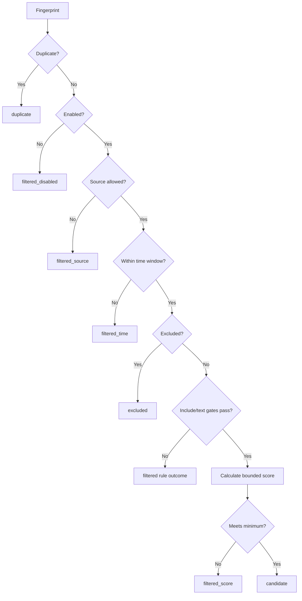

# Rule Engine

## Configuration format

Rules can be JSON or YAML. Both snake_case fields used in examples and the internal camelCase equivalents are accepted where documented. Unknown fields are rejected after parsing.

```yaml
id: product-feedback
name: Product feedback
description: Recent actionable feedback
enabled: true
priority: high

time_window:
  days: 14

source_filter:
  - support-export

include:
  - issue
  - feedback

exclude:
  - advertisement
  - sponsored

text_contains:
  - product-name

score:
  urgent: 25
  broken: 18
  refund: 12

basic_score: 3
minimum_score: 20
deduplication: content
```

## Fields

| Field              | Meaning                                                                             |
| ------------------ | ----------------------------------------------------------------------------------- |
| `id`               | Stable rule identifier. Generated from name and document hash when omitted.         |
| `name`             | Human-readable name, required.                                                      |
| `description`      | Optional description, up to 500 characters.                                         |
| `enabled`          | Disabled rules filter every item.                                                   |
| `priority`         | `low`, `normal`, `high`, or `critical`; copied to candidates.                       |
| `time_window.days` | Positive number of days, up to 3,650. Missing/future-invalid dates fail the window. |
| `source_filter`    | Exact normalized source-name allowlist. Empty means all sources.                    |
| `include`          | At least one term must match when the list is non-empty.                            |
| `exclude`          | Any matching term excludes the item before scoring.                                 |
| `text_contains`    | A second optional contains gate; at least one must match.                           |
| `regex`            | Reserved; any non-empty value is rejected in `v0.4.0`.                              |
| `score`            | Per-term integer weights from -100 to 100.                                          |
| `basic_score`      | Starting score from 0 to 100.                                                       |
| `minimum_score`    | Minimum final score from 0 to 100.                                                  |
| `deduplication`    | `content`, `id`, or `url`. URL falls back to content when missing.                  |

Keyword lists are trimmed, deduplicated, limited to 250 entries, and compared after Unicode NFKC normalization, lowercasing and whitespace collapsing. A list entry can be up to 160 characters.

## Evaluation order



Deduplication is intentionally first, so a repeated input does not re-enter later stages. Exclusion runs before scoring. The final score is clamped to `0..100`.

## Scoring

1. Begin with `basic_score`.
2. Each matched include term adds its configured score, or 10 when no explicit score exists.
3. A scored term that is not already counted as an include term adds its configured value.
4. Round and clamp the result to `0..100`.
5. Keep the item only when it meets `minimum_score`.

Negative configured weights can reduce a score. Exclusion is a stronger rule and removes an item without considering its score.

## Deduplication

- `content`: hash normalized `source + title + content`
- `id`: hash `source + id`
- `url`: hash URL, or use content when URL is absent

The SHA-256 fingerprint is compared against earlier items in the same run and candidates stored for the same `sourceRecordId + ruleId + ruleRevision` scope. The semantic revision is a deterministic SHA-256 digest of evaluation-relevant rule fields; timestamps, formatting, name, and description do not change it. Editing filters, scores, priority, or another evaluation field creates a new revision and allows historical content to be evaluated again. Re-saving equivalent rule semantics retains the revision and suppresses repeats. Another rule and another imported source have independent persisted scopes.

Before evaluation, items are ordered by fingerprint and stable item fields. Candidates are then ordered by score, fingerprint, and item ID. This prevents input array order from deciding which duplicate record represents a candidate. These hashes are identity mechanisms, not security signatures.

## Time behavior

Items with no valid `publishedAt` fail a configured time window. Timestamps over five minutes in the future also fail. Without a time window, a missing timestamp is allowed.

## Safety and performance

Rule documents are capped at 100,000 characters by desktop IPC and YAML aliases are limited. A non-empty `regex` field is rejected before save, rejected when a stored workspace is parsed, and rejected defensively by the engine. No user-supplied regular expression executes in the Electron main process in `v0.4.0`. Regex support may return only after worker or process isolation provides a tested hard execution timeout.

## Testing a rule

Use synthetic fixtures and include at least one record for every expected outcome. The main demo is a reference: 80 inputs produce fixed candidate, duplicate, exclusion, time, and score-filter counts. Run:

```bash
npm run test:integration
```
